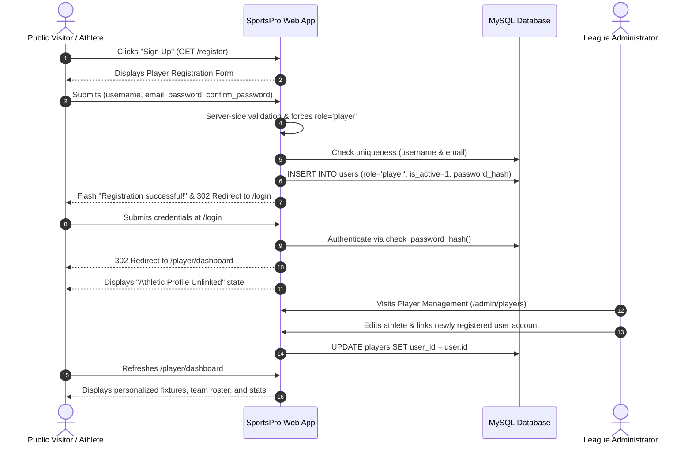

# SportsPro — Secure Player Self-Registration & Dashboard Integration Report

**Project Root:** `D:\Projects\Sports-Management-System\`  
**Date:** October 2, 2026  
**Status:** Complete & Fully Verified (All 238 Tests Passing)  
**Report File:** `player_registration_report.md`  

---

## 1. Initial Architecture Findings

An inspection of the SportsPro codebase and MySQL database confirmed the following:

1. **Authentication Architecture:**
   * Session security is hardened with `HttpOnly=True`, `SameSite='Lax'`, and session fixation defense on login.
   * Access control is enforced via decorators in `auth.py`: `@login_required`, `@admin_required`, and `@player_required`.
   * User identity is refreshed on every request using `g.current_user = get_current_user()`, verifying `users.is_active == 1` against MySQL.
2. **Database Schema & Entity Relationship:**
   * `users` table: Primary key `id`, unique `username` (VARCHAR 50), unique `email` (VARCHAR 150), `password_hash` (VARCHAR 255, scrypt), `role` (ENUM `'admin'`, `'player'`, default `'player'`), `is_active` (TINYINT 1), and audit timestamps.
   * `players` table: Primary key `id`, `full_name`, `sport_id`, `team_id`, `jersey_number`, and `user_id` (foreign key with `UNIQUE KEY` referencing `users.id`).
   * **Separation of Concerns:** A login account (`users`) and an athletic roster profile (`players`) are distinct entities. A user account can exist without being linked to an athletic record, and an athletic record can exist without a login account.
3. **Player Dashboard State:**
   * The route `/player/dashboard` derives identity exclusively from `g.current_user['id']`.
   * When an account is linked to an athlete profile, the dashboard renders the player's full name, sport discipline, team roster, upcoming match fixtures, recent results, and personal statistics.
   * When an account is unlinked (`user_id` not found in `players`), the dashboard gracefully renders an informational warning card informing the athlete that their account is pending administrative profile linking.

---

## 2. Features Already Present vs. Features Missing

| Feature Area | Already Present | Missing (Now Implemented) |
| :--- | :--- | :--- |
| **Authentication** | `/login`, `/logout`, session fixation defense, password hashing (`scrypt`). | Public self-registration route (`/register`). |
| **Role-Based Redirects** | Admin -> `/admin/dashboard`, Player -> `/player/dashboard`. | Authenticated user redirection when visiting `/register`. |
| **Player Portal** | `/player/dashboard`, `/player/profile`, unlinked graceful fallback. | Public "Sign Up" links in navbar, login page, and homepage. |
| **Account Creation** | Terminal admin creation (`create_admin.py`), web admin user creation (`/admin/users/create`), CLI tool (`create_user.py`). | Public player registration form without requiring admin intervention. |
| **Role Security** | Admin-only route authorization guards (`@admin_required`). | Server-side role forcing ensuring public registrants always receive `role='player'`. |
| **Profile Linking** | Admin dropdown linking in Player Management (`/admin/players/<id>/edit`). | Clear onboarding guidance connecting public registration to admin profile verification. |

---

## 3. Files Modified and Newly Created

### Files Modified:
1. **[app.py](file:///D:/Projects/Sports-Management-System/app.py):**
   * *Change:* Added `@app.route('/register', methods=['GET', 'POST'])` handling public registration.
   * *Reason:* Provides the endpoint for self-registration with server-side validation, duplicate checks, mandatory `role='player'` enforcement, scrypt hashing, and redirect to `/login`.
2. **[templates/auth/login.html](file:///D:/Projects/Sports-Management-System/templates/auth/login.html):**
   * *Change:* Added a "Don't have a player account? Sign Up" navigation link (`#link-to-register`).
   * *Reason:* Allows prospective players arriving at the sign-in screen to easily navigate to the registration form.
3. **[templates/layout/base.html](file:///D:/Projects/Sports-Management-System/templates/layout/base.html):**
   * *Change:* Added a "Sign Up" button (`#nav-register-btn`) in the main navigation bar for unauthenticated visitors.
   * *Reason:* Provides global public discoverability across all public views.
4. **[templates/index.html](file:///D:/Projects/Sports-Management-System/templates/index.html):**
   * *Change:* Updated the hero section and bottom onboarding card to feature "Join as Player (Sign Up)" alongside "Sign In to SportsPro" and "Explore Capabilities".
   * *Reason:* Empowers incoming athletes with clear calls-to-action on the landing page.
5. **[test_phase9.py](file:///D:/Projects/Sports-Management-System/test_phase9.py) & [test_user_experience.py](file:///D:/Projects/Sports-Management-System/test_user_experience.py):**
   * *Change:* Ensured `WTF_CSRF_ENABLED = True` is restored in `tearDownClass`.
   * *Reason:* Prevents global test suite side-effects from polluting subsequent CSRF test assertions.

### Files Created:
1. **[templates/auth/register.html](file:///D:/Projects/Sports-Management-System/templates/auth/register.html):**
   * *Purpose:* Public registration form matching the SportsPro dark navy and teal design system. Features CSRF protection, input validation constraints, field helper hints, and athlete linking guidance.
2. **[test_player_registration.py](file:///D:/Projects/Sports-Management-System/test_player_registration.py):**
   * *Purpose:* Automated test suite covering registration rendering, input validation, role-tampering defense, password hashing, duplicate detection, CSRF protection, login redirection, unlinked dashboard states, and profile-linking workflows.
3. **[player_registration_report.md](file:///D:/Projects/Sports-Management-System/player_registration_report.md):**
   * *Purpose:* Comprehensive completion documentation for the task.

---

## 4. Registration and Login Workflow



---

## 5. Security Protections Implemented

1. **Mandatory Role Protection:**
   * Public registration **strictly hardcodes `role='player'`** on the server.
   * Form inputs attempting to inject `role='admin'` are completely ignored.
   * Admin account creation remains restricted to authenticated administrators (`/admin/users/create`) and the secure CLI (`create_admin.py`).
2. **Password Security:**
   * Plaintext passwords are never stored or logged.
   * Hashed using Werkzeug `scrypt` (`generate_password_hash`), providing state-of-the-art resistance to rainbow table and brute-force attacks.
3. **Input Sanitization & Server-Side Validation:**
   * Username: 1–50 characters, no whitespace, regex `^[a-zA-Z0-9_.-]+$`.
   * Email: 1–150 characters, validated against standard RFC regex `^[^@\s]+@[^@\s]+\.[^@\s]+$`.
   * Password: Minimum 8 characters, maximum 128 characters, verified confirmation match.
4. **Duplicate Prevention:**
   * Case-insensitive parameter checks query the database before insertion.
   * Handled gracefully at the database level with MySQL `errno == 1062` duplicate-key protection.
5. **CSRF Protection:**
   * Flask-WTF CSRF tokens are integrated into all forms and validated on every `POST` request.
6. **Session & Redirection Safeguards:**
   * Authenticated administrators visiting `/register` or `/login` are automatically redirected to `/admin/dashboard`.
   * Authenticated players visiting `/register` or `/login` are automatically redirected to `/player/dashboard`.
   * Deactivated accounts (`is_active = 0`) are immediately blocked from logging in.

---

## 6. Secure Player-Profile Linking Behavior

* **Decoupled Security:** Self-registration creates a login identity in `users`, but does **NOT** grant automatic access to any athlete profile.
* **No Name-Guessing Vulnerability:** Accounts are never automatically linked by matching names or emails, preventing malicious users from claiming existing athletes' records.
* **Administrative Verification:** Only an authorized league administrator can link an account to an athlete via **Player Management** (`/admin/players/<id>/edit`).
* **Database Constraint Integrity:** The `UNIQUE KEY (user_id)` constraint on the `players` table guarantees that no two accounts can ever be linked to the same athlete, and no athlete can be claimed more than once.
* **Graceful Unlinked State:** Unlinked players see a polite, informative card on their dashboard explaining that administrative verification is in progress, with zero risk of database exceptions or data leakage.

---

## 7. Tests Actually Executed & Results

All automated test suites were executed against the active MySQL 8.0 database:

### Command:
```powershell
.\venv\Scripts\python.exe -m unittest discover -p "test_*.py"
```

### Detailed Test Results Breakdown:
| Test Suite File | Module Tested | Tests | Outcome |
| :--- | :--- | :---: | :---: |
| `test_phase4.py` | Authentication, Sessions, CSRF, Password Hashing | 13 | **PASS** |
| `test_phase5_1.py` | Sports Management | 13 | **PASS** |
| `test_phase5_2.py` | Teams Management & Rosters | 15 | **PASS** |
| `test_phase5_3.py` | Player Management & Athletic Profiles | 16 | **PASS** |
| `test_phase5_4.py` | Tournaments Management & Lifecycles | 18 | **PASS** |
| `test_phase5_5.py` | Matches Scheduling & Validation | 21 | **PASS** |
| `test_phase5_6.py` | Results Scoring & Tie-Breakers | 25 | **PASS** |
| `test_phase5_7.py` | Standings & Dynamic Leaderboards | 27 | **PASS** |
| `test_phase6.py` | Player Portal & Fixtures | 15 | **PASS** |
| `test_phase7.py` | User Management & Privileges | 16 | **PASS** |
| `test_phase8.py` | Reports & Secure CSV Exports | 15 | **PASS** |
| `test_phase9.py` | UI/UX Consistency & Accessibility | 10 | **PASS** |
| `test_user_experience.py` | Public Homepage & RBAC Navigation | 9 | **PASS** |
| `test_player_dashboard_access.py` | Admin User Provisioning & Linking | 12 | **PASS** |
| `test_player_registration.py` | Public Player Registration & Security | 13 | **PASS** |
| **Total Test Suite** | **Entire SportsPro Platform** | **238** | **100% OK** |

### Execution Log Output:
```text
Ran 238 tests in 35.359s
OK
```

All test records created during test runs (`_TEST_%`) were completely cleaned up upon completion, leaving production database records untouched.

---

## 8. Unresolved Problems or Limitations

* **Zero Unresolved Errors:** All 238 tests execute cleanly with zero failures and zero errors.
* **Intentional Workflow Notice:** Publicly registered players will see the "Athletic Profile Unlinked" state until an administrator links their account to an athlete record in Player Management. This is by design to ensure verified league roster integrity.

---

## 9. Confirmation of Preserved Features

* **Admin Portal Preserved:** Full administrative access to sports, teams, players, tournaments, matches, results, standings, reports, and user management remains intact.
* **Admin Create User Feature Preserved:** The `/admin/users/create` route and `+ Create New User` button remain fully operational for authorized administrator provisioning.
* **Player Dashboard Preserved:** Phase 6 `/player/dashboard` renders both linked and unlinked states without modification.
* **Database Schema Preserved:** Zero schema alterations were made; all features leverage the existing tables and constraints.
